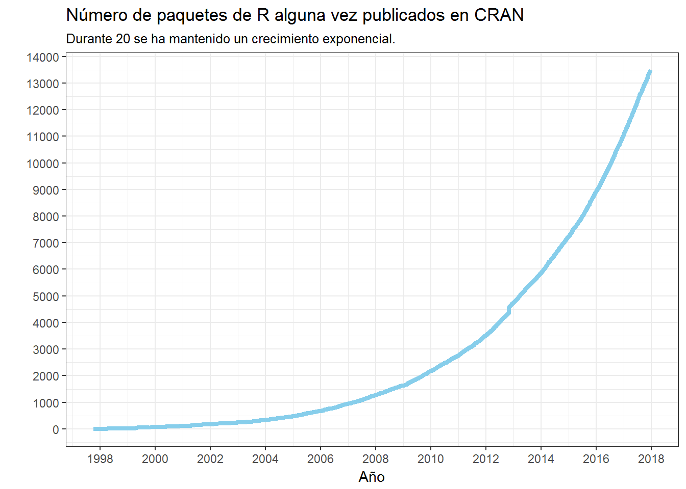
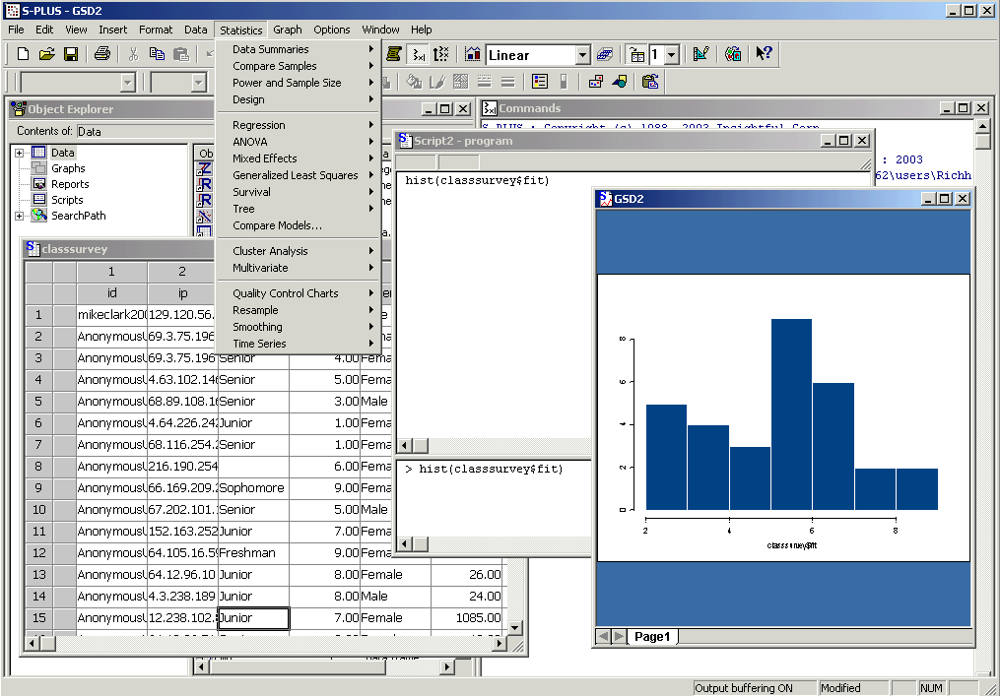
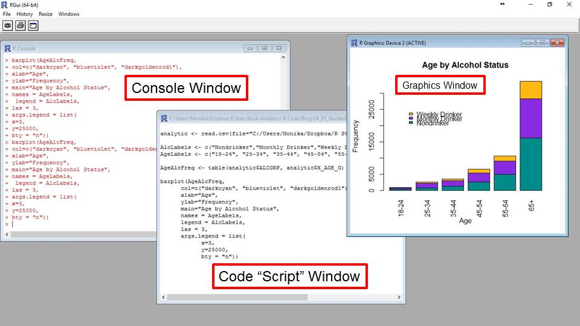
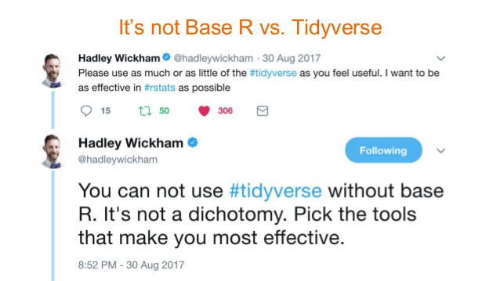
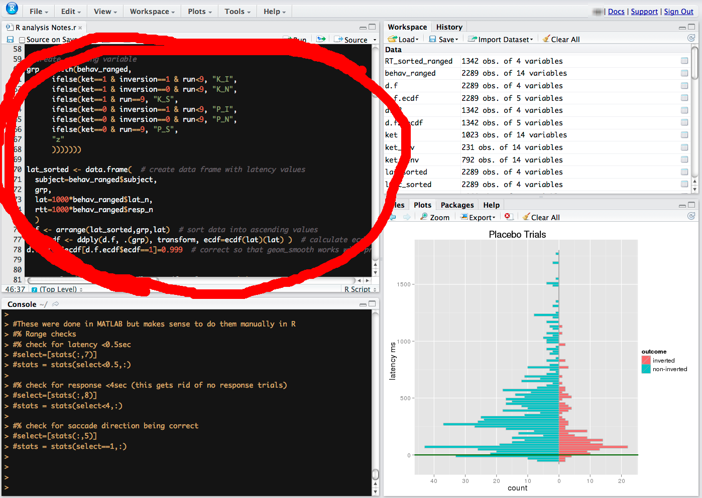
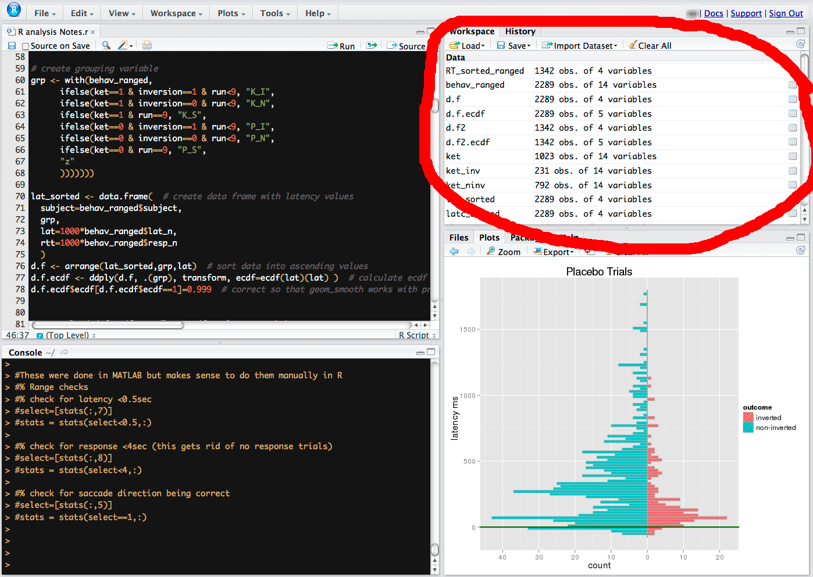
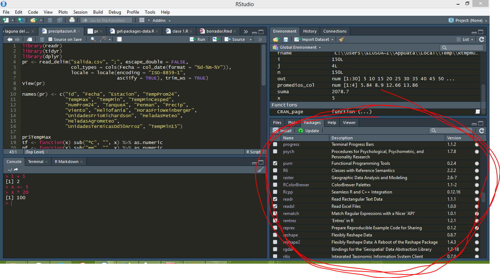

```{r setup, include=FALSE}
# Preparación de sesión de R
knitr::opts_chunk$set(echo = TRUE, message = FALSE)
library(tidyverse)
```

# Primero las presentaciones

## Qué es R

Se puede encontrar por ahí que R es un "Ambiente de computación estadística". Con esto quieren decir muchas cosas, pero sobre todo R es:

- Un lenguaje de programación
- Una serie de "paquetes" (funcionalidades) con soluciones para un amplio rango de tareas estadísticas, incluyendo modelación, aprendizaje automático, clasificación, etc.
- Trabajar con tablas de datos complejas, siguiendo una lógica similar a una base de datos (ie: tablas con columnas de distinto tipo, como pueden ser numéricas, texto, fechas, etc...).
- Herramientas gráficas poderosas para visualizar la información.


## R como herramienta

> Cada herramienta para la tarea que fue concebida.

R está concebido para estadística y análisis de datos y, como tal, hacemos bien en usarlo para este cometido, combinándolo con otras herramientas que son las indicadas para diferentes tareas (ej.: seremos mucho más productives usando un SIG para trabajar con mapas, aún si [hay formas de usar R para esto](https://pakillo.github.io/R-GIS-tutorial/)*).

(*: No queremos decir con esto que sea necesariamente malo usar R para trabajar con SIG, o cualquier otra tarea, solo que en general recomendamos usar la herramienta correcta para cada cometido.)

R se caracteriza por tener muchas funcionalidades a disposición y muchas formas de lograr el miso resultado (punto que genera alguna discordia entre la comunidad de usuaries). El lado positivo es que ofrece una gran flexibilidad y permite a cada quién encontrar su forma de hacer las cosas. Por otro lado esto también puede generar desconcierto, especialmente en principiantes.

Como todo en la vida, hay que buscar un balance entre costos y beneficios, y R no es la excepción.

### Costos:

Hay que ser baqueane: R requiere un cierto manejo mínimo para poder explotar sus potencialidades. Para un mortal cualquiera, es como empezar a andar en bici sin rueditas luego de usarlas toda la vida.

> R nos da todos los ingredientes para hacer lo que querramos... sólo faltan las instrucciones!

---


---

La realidad es que hay más instrucciones disponibles de lo que parece al principio, y en verdad R nos proporciona muchas herramientas muy elaboradas para hacer lo que precisamos, las cuales se potencian cuando las empezamos a combinar.

> En otras palabras, *no es tan así*.

De todas formas, si bien la forma de interactuar con R ha evolucionado mucho en los últimos años (ej: RStudio), sigue siendo desafiante y contraintuitivo en los primeros pasos. Una fuente de frustración frecuente es que exige mucha precisión a la hora de escribr los comandos. Otra es el enigmático lenguaje en que se expresa toda la información, desde los comandos hasta la documentación, pasando por los mensajes de error y de advertencia.

### Beneficios:

Para empezar, R es **[Software Libre](https://es.wikipedia.org/wiki/Software_libre)**.

Esto implica varias cosas:

- Es gratis.
- Cualquiera puede "ver las [entrañas](https://stat.ethz.ch/R/daily/)" del software.
- Incorpora aportes de la comunidad de usuarios, generalmente en forma de paquetes / bibliotecas, pero también a través de tutoriales o cursos, muchos de ellos gratuitos.

---

```r
# Código R: número de paquetes en CRAN vs. año
require(ggplot2)
pkgs <- read.csv("../data/paquetes.csv")
ggplot(pkgs, aes(as.Date(first_release), index)) +
  geom_line(size = 1.5, col = "skyblue") +
  scale_x_date(date_breaks = '2 year', date_labels = '%Y') +
  scale_y_continuous(breaks = seq(0, 14000, 1000)) +
  xlab("Año") + ylab("") + theme_bw() +
  ggtitle("Número de paquetes de R alguna vez publicados en CRAN", 
          "Durante 20 se ha mantenido un crecimiento exponencial.")
```



([Idea original y reporte por Henrik Bengtsson.](https://stat.ethz.ch/pipermail/r-devel/2016-February/072388.html))

---

Además, R proporciona una **enorme flexibilidad**: *el cielo es el límite*.

Por último, todes contamos con el **apoyo de una gran comunidad de usuaries**: la adopción de R como lingua franca en estadística a través de continentes y disciplinas ha sido explosiva en la última década. Esta comunidad se caracteriza, como tantas otras en Software Libre, por una gran solidaridad para ayudar a quiénes lo necesitan. En la práctica, esto se traduce en listas de mail, foros y comunidades dedicadas al tema (ej: [R-Ladies Montevideo](https://twitter.com/RLadiesMVD)). [Más info acá](https://www.r-project.org/help.html).

Recomendación: explorar [datacamp.com](https://www.datacamp.com/community/open-courses), puede que encuentren algún [curso de R en español](https://www.datacamp.com/community/open-courses/introduccion-a-r). También: [serie de videos del curso IMSER](https://www.youtube.com/watch?v=b-y3-7wMeco&list=PL41C5vgvqV_PA-e634Q4wn5MKbubqv6P9).

## Evolución de R y su interfaz:

El R fue creado hace unos 20 años aproximadamente, basado en S+, un software propietario con los mismos fines y sintaxis similar.

-------



Durante mucho tiempo mantuvo una interfaz gráfica (GUI) muy básica (en Windows, en Linux era más que nada usado en la línea de comandos o CLI).

------



-------

Desde el 2011 existe un entorno de desarrollo integrado (IDE) que rápidamente se popularizó, convirtiéndose prácticamente en la interfaz estándar entre la comunidad de usuarios de R.

-------


-------

No conformes con reconfigurar la forma en que interactuamos con R a nivel de IDE, esta gente ha desarrollado un conjunto de paquetes "con opiniones fuertes", que está diseñado para trabajar bien en conjunto. Este conjunto se a dado a llamar **tidyverse**, y al igual que RStudio, ha ganado mucha popularidad.

-------


-------



-------


# Conceptos y comandos básicos

## Primeros pasos

Lo más sencillo tal vez sea escribir una suma y ejecutarla:

```r
1 + 1
```

(Escribir el comando / expresión que queremos ejecutar y apretar Enter)

Al hacer esto R nos da inmediatamente el resultado, usando una codificación para distinguir comandos (input; entradas) de resultados (output; salidas):

```r
> 1 + 1
[1] 2
```

El input es `1 + 1` y el output es 2. El `[1]` que allí aparece indica que 2 es el primer elemento de la salida.

Si nuestro comando está incompleto, R nos indica que hay que seguir escribiendo, con el prompt `+`:

```r
> 1 + 1 + 89 + 5 * 3 +
+ 
```

Otra cosa muy útil es que lás órdenes se pueden reciclar: la historia de comandos se guarda automáticamente y se puede recorrer con las flechas hacia arriba y hacia abajo. En RStudio además hay una ventanita en la que podemos ir viendo esa historia a medida que ejecutamos comandos.

> Navergar por la historia de comandos ejecutados.

> Experimentar con algunos comandos más:

```r
sqrt(2)
rnorm(50)
plot(rnorm(50))
?rnorm
```


## Guiones (scripts)

La dinámica de trabajo típica con R involucra el uso de guiones, que no son otra cosa que archivos de texto plano con una serie de comandos de R.

> Un formato de texto plano conocido es el `.txt`, así como los `.csv`; la extensión no es más que un detalle. En el caso de R, se utilizan las extensiones `.R` o `.r`.

Los guiones nos permiten ir guardando nuestro trabajo y volver a utilizarlo cuando precisemos. También facilitan el compartir con otras personas este trabajo. Los comandos contenidos en ellos conforman el llamado **[código fuente](https://es.wikipedia.org/wiki/C%C3%B3digo_fuente)** (source code, en inglés).

-------



-------

Con la popularización de RStudio, la forma de interactuar con los guiones cambió bastante, debido a una simple combinación de teclado:

    Ctrl + Enter

Probemos algunos ejemplos, cada uno en su PC:

```r
1 + 1
sqrt(9)
log(76)
exp(46 * 4 - 1)
```

La idea de este comando es ir avanzando línea a línea por nuestro código fuente, contenido en el guión de R.

Otras facilidades de RStudio:

- **Ejecutar código seleccionado**: si sombreamos un pedazo de código y apretamos `Ctrl + Enter`, ejecuta sólo esa parte.
- **Autocompletado**: a medida que escribimos un nombre nos sugiere opciones para completar (ej.: `col...`). Usar tecla "tab" (indentación).
- **Argumentos de las funciones**: cuando escribimos una función nos muestra los argumentos que lleva (ej.: `log`). Usar tecla "tab" (indentación).
- **Otras**: navegación por el guión, "embellecer código", atajos (`Alt + Shift + k`) y más ...

Más info: [curso R](https://github.com/jumanbar/Curso-R/blob/master/lecciones/1.4-scripts-y-directorio-de-trabajo.markdown)

## Sesión de R

Al abrir R siempre se inicia una nueva sesión (o se carga una anterior). Una sesión está compuesta por el conjunto de objetos que nosotres *cargamos* en ella. Un ejemplo bien simple es crear un objeto, usando la asignación `<-` (`=` también funciona):

```r
x <- 5
```

Luego de ejectuar este comando, podemos utilizar al objeto `x` en futuros comandos. Por ejemplo:

```r
x * 4
```

Los objetos de la sesión se pueden ver con el comando `ls()`, o mirando la sección "Ambiente" de la ventana de RStudio. En caso de querer eliminar un objeto de nuestra sesión, usamos la función `rm` (ejemplo: `rm(x)`).

---



---


A los objetos que creamos se le suman aquellos paquetes que cargamos con el comando `library()`.


```r
library(readxl) # Probar con otros paquetes, si este no funciona
```


Aquí también nos auxilia la interfaz de RStudio, gracias a la ventana "paquetes", que nos lista los paquetes dispoinbles y aquellos que ya están cargados en nuestra sesión.


---




# R y tu: como construir un buen vínculo

El objetivo de esta clase es facilitar la adopción de R como una herramienta más en el repertorio de cada une.

## Puntos clave para llevarse bien con R:

- Utilizar la ayuda
- Utilizar Google
- Utilizar la ayuda
- *Leer detenidamente los mensajes de error*
- Preguntar
- Probar
- Utilizar la ayuda

> Es posible que hayamos repetido algunos ítems

## Utilizando la ayuda

En inglés se popularizó la sigla RTFM (Read The Fucking Manual). Más allá de que tiene más agresividad verbal de la necesaria, expresa con claridad una sensación: de que nadie se toma trabajo para leer manuales.

> Que por otro lado, es entendible

Insistimos en apoyarse en la ayuda porque es lo que hacemos en la práctica. En nuestra experiencia, R tiene de las mejores documentaciones disponibles, cubriendo:

- **Funciones**: cada función tiene una página de documentación en la que idealmente se explican todos los requisitos, opciones y comportamientos de la misma.
- **Temas**: hay funcionalidades que se engloban dentro de un tema o una tarea y también tienen su página dedicada (ej.: [control de flujo](https://es.wikipedia.org/wiki/Estructuras_de_control)).
- **Conjuntos de datos**: datos que vienen incluidos en el R básico o en paquetes agregados (ejs.: `iris`, `cars`).


Todas las páginas de ayuda de R están estructuradas de la misma manera, lo cual es de gran utilidad para le usuarie. Empezamos con el caso de las funciones ya que en general incluyen casi todas las secciones estándar de la documentación.

### Documentación de funciones

Uno de los comandos que más usamos los usuarios de R es `help`. El mismo se puede usar de varias formas:

```r
help(sort)
?sort
?"sort"
```

En los tres ejemplos lo que se está pidiendo es que se abra la página de ayuda de la función `sort`. Este tipo de documento tienen varias secciones, siempre ordenadas de la misma manera y con una estructura predeterminada, más allá de que no siempre están todas. Haciendo un breve resumen, se trata de:

- **Nombre, título y descripción**: una sinópsis de lo que hace la función. En general "Description" es el punto más informativo.
- **Uso**: muestra como se estructura un *llamado* a la función, incluyendo los argumentos, valores por defecto y métodos por defecto.
- **Argumentos**: una lista de los argumentos de la función con una descripción para cada uno. Importante para entender qué es lo que la función espera como *entrada* (ie: no podemos darle tomates si lo que espera son lechugas).
- **Detalles**: se trata de una sección genérica de texto, que puede tener mucha o poca información. Es muy útil para entender los comportamientos de la función en distintas situaciones.
- **Valor**: es una descripción de la *salida* de la función. También puede explicar comportamientos para distintas situaciones. Si esperábamos boñatos y nos está dando papas, aquí debería estar la explicación.
- **Referencias**: referencias bibliográficas utilizadas en el texto.
- **Ver también**: otras páginas de ayuda (de temas o funciones) que están vinculadas a la actual y que nos pueden ser útiles o de interés.
- **Ejemplos**: bloques de código que podemos ejecutar en la consola para ver ejemplos de la función en acción. Se pueden correr también usando la función **`example`** (a menos que sea un bloque iniciado por la línea `## Not run:`).

### Documentación de temas y datasets

Podemos probar con el siguiente comando:

```r
?Distributions
```

Se trata de una página de ayuda estándar, pero enfocada en una temática en particular (en el ejemplo, las funciones para trabajar con [distribuciones de probabilidad](https://es.wikipedia.org/wiki/Distribuci%C3%B3n_de_probabilidad) incluidas en el paquete `stats`). Pueden faltar secciones, como "Argumentos", que no tienen sentido ser incluidas aquí.

Por otro lado, los conjuntos de datos, o datasets, también tienen sus propias páginas de ayuda. Se trata generalmente de tablas con datos que sirven de ejemplo para ilustrar funcionalidades de R y/o paquetes agregados. Uno de los ejemplos más clásicos es:

```r
?iris # Edgar Anderson's Iris Data
```

Más sobre el uso de la ayuda de R [aquí](https://github.com/jumanbar/Curso-R/blob/master/lecciones/1.3-uso-de-la-ayuda.markdown)

## Mensajes de error

En la experiencia de quien está aprendiendo R, o cualquier lenguaje de programación, los mensajes de error son una de las cosas más temidas. Sin embargo, pueden ser muy útiles si decodificamos la información que nos brinda.

Estos mensajes se pueden clasificar en las siguientes categorías:

- **Errores de sintaxis**: ocurren cuando una sentencia está incorrectamente estructurada. Ejemplos típicos son la falta de una coma o un paréntesis.
- **Objetos no encontrados**: los cuales ocurren cuando
    + El nombre de un objeto no se escribió correctamente. Un caso típico es poner mal mayúsculas o minúsculas.
    + El paquete o archivo que contiene al objeto no ha sido cargado aún.
    + Faltaron comillas en el lugar que corresponde.
    + Algún otro motivo (use la imaginación).
- **Otras causas**: en cuyo caso suele ser muy útil la función `traceback`.

Para enfrentar estos casos, lo mejor es evitar que ganen los nervios y leer detenidamente los mensajes, buscando encontrar cuál de estas fuentes es la más probable. Sin dudas que la experiencia ayuda mucho en estas situaciones.

También es muy útil utilizar google u otros buscadores: copiar el mensaje de error y buscar en internet, en lo posible omitiendo las partes que son específicas de nuestra situación particular.

Como mencionábamos antes, también es importante probar, experimentar, para determinar cuál es el problema (por ejemplo, quitando partes al código que genera el error, hasta quedar con lo mínimo necesario para reproducirlo).

En último término, está la posibilidad de pedir ayuda, tanto a personas que conocemos como a comunidades en internet (ej.: stackoverflow). Esto ya lo mencionamos en esta misma clase (ver sección "Beneficios").

## Aplicado estos conceptos a un ejemplo

```r
> plot(sort(rnorm(60)), pch=8, col=red, xlab="Rank",
+ ylab="Variable Gaussiana")
Error in plot.xy(xy, type, ...) : object 'red' not found

> plot(sort(rnorm(60)), pch=8, col="red", xlab="Rank"
+ ylab="Variable Gaussiana")
Error: unexpected symbol in:
"plot(sort(rnorm(200)), pch=8, col="red", xlab="Rank"
ylab"

> plot(sort(rnorm(60)), pch=8, col="red", xlab="Rank",
+ xlab="Variable Gaussiana")
Error in plot.default(sort(rnorm(200)), pch = 8, col = "red", xlab = "Rank",  : 
  formal argument "xlab" matched by multiple actual arguments
```

Y sin embargo el siguiente comando sí está escrito correctamente:

```r
plot(sort(rnorm(60)), pch=8, col="red", xlab="Rank",
ylab="Variable Gaussiana")
```


------

Más sobre errores y afines [aquí](https://github.com/jumanbar/Curso-R/blob/master/lecciones/1.3.b-extra-errores-y-afines.markdown).
